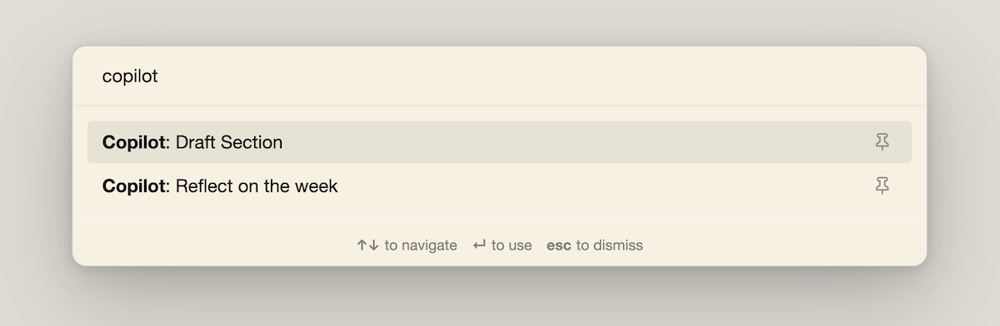
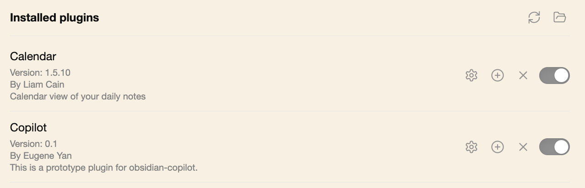
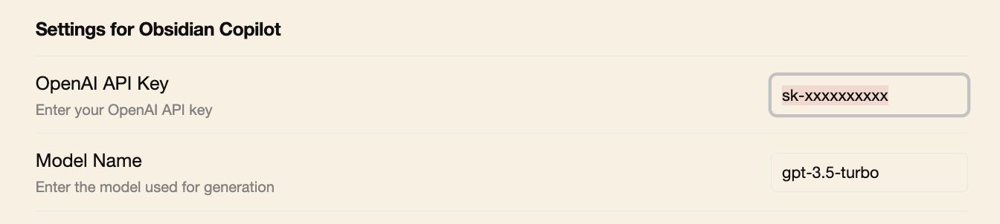

# Obsidian-copilot

## How would a copilot for writing and thinking look like?

Here's a possible implementation: You write a section header and the copilot retrieves relevant notes & docs to draft that section for you. This pattern of [retrieval-augmented generation](https://arxiv.org/abs/2005.11401) can also be extended to other use cases. Here's an example where the copilot helps you reflect on your week based on your daily journal entries.

https://github.com/eugeneyan/obsidian-copilot/assets/6831355/70ef5412-74a4-449d-9d37-6668ae7ed36a

Currently, copilot helps you:
- Draft sections based on your notes
- Reflect on your week based on your daily journal entries



More technical details on how it works here: [Obsidian-Copilot: A Prototype Assistant for Writing & Thinking](https://eugeneyan.com/writing/obsidian-copilot/)

## Quick start

Clone and update the path to your obsidian-vault and huggingface hub cache

```
git clone https://github.com/eugeneyan/obsidian-copilot.git
```

Update your `~/.bashrc` or `~/.zshrc` with the `OBSIDIAN_PATH` and `TRANSFORMER_CACHE` paths and then source it.
Note: the trailing slash is important.

```

export OBSIDIAN_PATH=/path/to/obsidian-vault/
export TRANSFORMER_CACHE=/path/to/.cache/huggingface/hub
```

If you don't already have a huggingface hub cache, you can create the directory with `mkdir -p $TRANSFORMER_CACHE`

Build the OpenSearch and semantic indices
```
# Build the docker image
make build

# Start the opensearch container and wait for it to start. 
# You should see something like this: [c6587bf83572] Node 'c6587bf83572' initialized
make opensearch

# In ANOTHER terminal, build your artifacts (this can take a while)
make build-artifacts
```

Running the retrieval app
```
# First, stop the opensearch container (CTRL + C). Then, start the retrieval app. 
# You should see this: Uvicorn running on http://0.0.0.0:8000
make run
```

Install the copilot-plugin, enable it in community plugin settings, and update the API key in copilot

```
make install-plugin
```




## How does it work?

At a high level, when you type a section header, it'll:
- Retrieve relevant documents/snippets from the your obsidian vault via:
    - [Keyword search](https://github.com/eugeneyan/obsidian-copilot/blob/main/src/prep/build_opensearch_index.py#L141) (opensearch)
    - [Semantic search](https://github.com/eugeneyan/obsidian-copilot/blob/main/src/prep/build_semantic_index.py#L119) (semantic retrieval)
- The retrieved context is then used to generate paragraphs for the section
- It is also displayed in a new tab for info

## TODOs

- [ ] Add support for using anthrophic claude (100k context)
- [ ] Assess sending in entire documents instead of chunks
